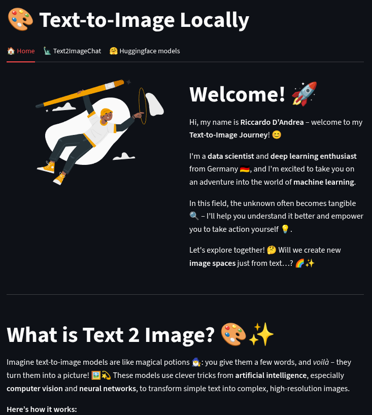

# 🎨 Text-to-Image Generator (Streamlit + Diffusers)

An interactive **Streamlit dashboard** for generating images from text prompts using HuggingFace **Diffusion Models** (e.g., Stable Diffusion, Dreamshaper, Juggernaut-XL).  
The app runs **locally on your GPU** and allows you to experiment with different models and adjust inference parameters.  

When you start, you will be welcomed on a **homepage** that introduces the developer and explains what **Diffusion Models** are.  



---

## 💬 User Interface

The UI is designed to feel **intuitive and familiar**:  
- A **chat window** is used to enter prompts.  
- At the same time, the generated images are displayed directly in the same window.  

👉 To get started, simply enter the **path to your model** in the chat window.  
The model will be automatically loaded into the pipeline.  


---

## 🤗 Model Selection

If you are unsure which models to use:  
- The **HuggingFace tab** contains a direct link to the [HuggingFace model hub](https://huggingface.co/models?pipeline_tag=text-to-image&sort=trending).  
- In addition, I included **three tested models** that I personally found to work very well.  

These models are explained in detail:  

1. **RunDiffusion/Juggernaut-XL-v9**  
2. **Lykon/dreamshaper-7**  
3. **UnfilteredAI/NSFW-gen-v2**


---

## 🚀 Features

- **GPU Monitoring**  
  Displays VRAM status (Total, Used, Free) directly in the sidebar.  

- **Interactive Interface**  
  - Chat-like interface for entering prompts  
  - Models can be loaded directly via **path**  

- **Model Help**  
  Explanations of popular HuggingFace models (e.g., Juggernaut, Dreamshaper).  

- **Text-to-Image Generation**  
  With adjustable **inference steps** for more control.  

- **Visual UI**  
  Animated elements with **Lottie** for an appealing user experience.  

---

## ⚙️ Installation

### 1️⃣ Clone the repository

```bash
git clone git@github.com:RiccardoDAndrea/Text-to-Image-Generator-Streamlit-Diffusers-.git
```

cd Text-to-Image-Generator-Streamlit-Diffusers-

### 2️⃣ Create a virtual environment (optional, recommended)

```bash
python3.11 -m venv venv
source venv/bin/activate   # Linux/Mac
venv\\Scripts\\activate    # Windows
```

### 3️⃣ Install dependencies

```bash
pip install -r requirements.txt
```

### ▶️ Run the application
```bash
streamlit run app.py
```